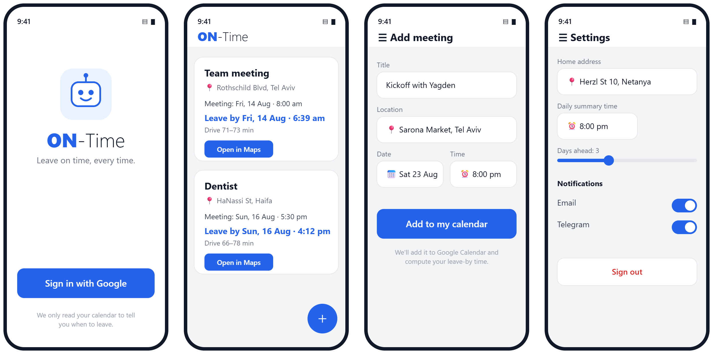
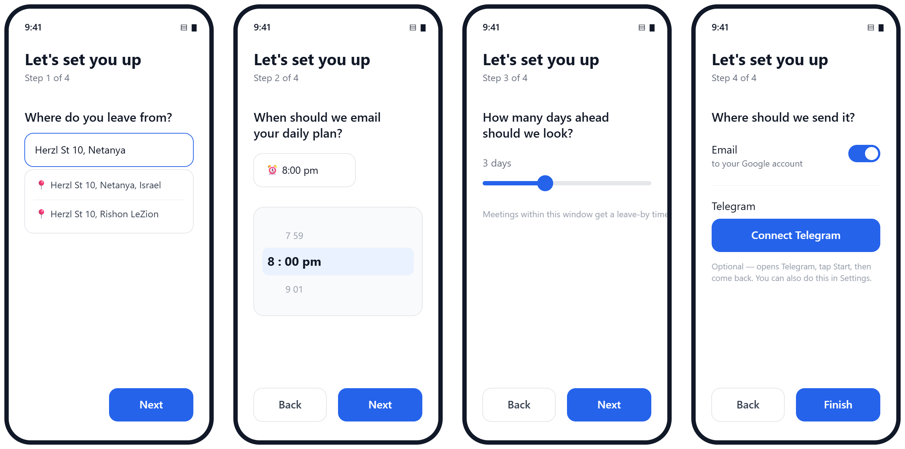
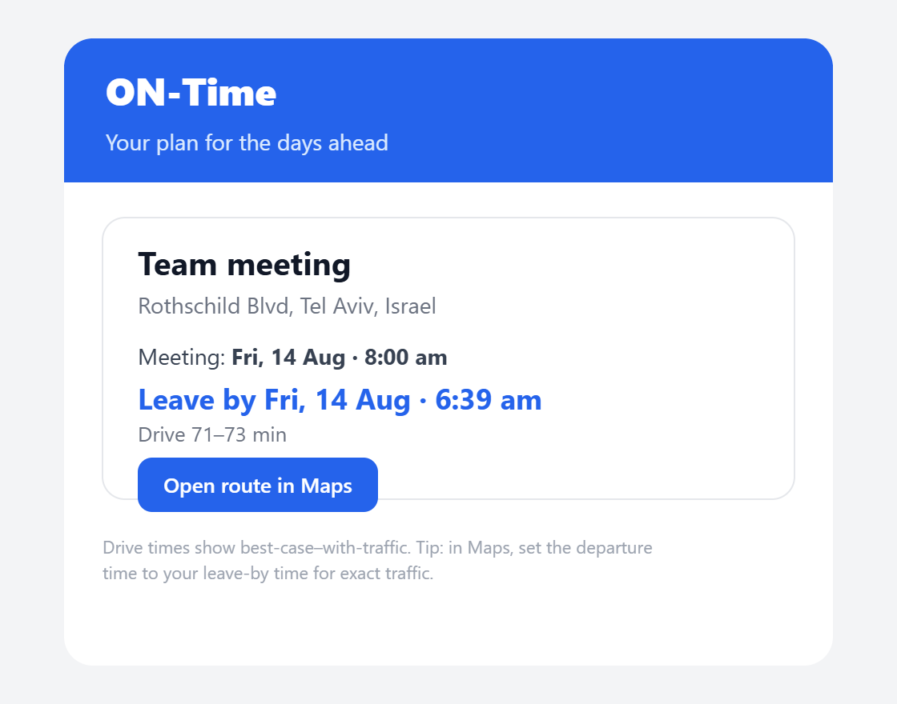
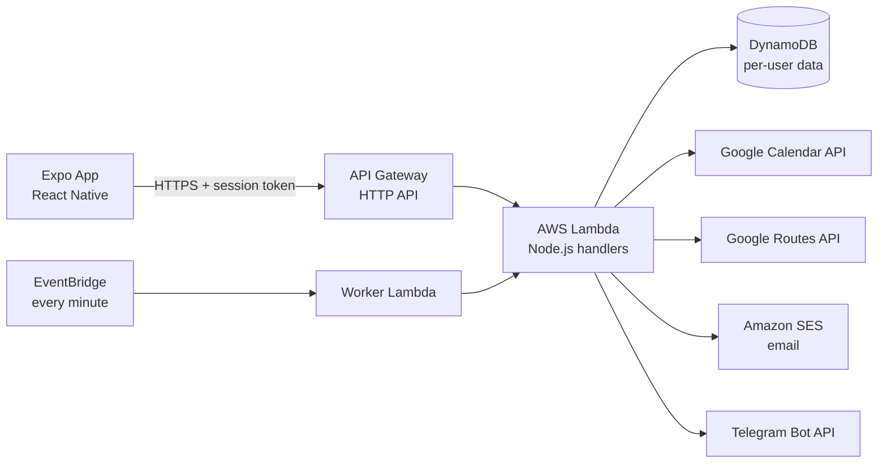

<div align="center">


# ON-Time

**Know exactly when to leave for every meeting.**

ON-Time reads your Google Calendar, checks live driving traffic, and tells you the precise time to head out — plus an optional daily summary by email and Telegram.

🌐 [ontime-plans.com](https://ontime-plans.com) · 📄 [Privacy Policy](https://ontime-plans.com/privacy.html)


-61dafb)


</div>

---

## 📸 Screenshots

*Welcome · Meetings · Add meeting · Settings*



**Onboarding (4 steps)** — *home address · daily time · days ahead · notifications*



**Daily summary email**



---

## 📖 Table of contents

- [What it does](#-what-it-does)
- [Why I built it](#-why-i-built-it)
- [How it works](#-how-it-works)
- [Using the app](#-using-the-app)
- [Architecture](#-architecture)
- [How sign-in works](#-how-sign-in-works)
- [Integrations & external services](#-integrations--external-services)
- [API reference](#-api-reference)
- [Tech stack](#-tech-stack)
- [Repository structure](#-repository-structure)
- [Key technical decisions](#-key-technical-decisions--challenges)
- [Running it locally](#-running-it-locally)
- [Deployment (CI/CD)](#-deployment-cicd)
- [Privacy & security](#-privacy--security)
- [Roadmap](#-roadmap)
- [License](#-license)

## ✨ What it does

- **📅 Reads your Google Calendar** — finds your upcoming meetings that have a location.
- **🚗 Checks live traffic** — asks Google's Routes API how long the drive will *really* take, using **predicted traffic for your meeting's time**, not just current conditions.
- **⏰ Tells you when to leave** — computes a clear "leave by" time for each meeting from your home address, minus the drive time, minus a safety buffer.
- **✉️ Daily summary** — optionally sends your plan for the day by **email** and **Telegram**, at a time you choose, delivered right on the minute.
- **➕ Add meetings in-app** — create an event and it's written straight to your Google Calendar.
- **🌍 Truly multi-user** — sign in with Google; every user has their own calendar, home address, timezone, and preferences, fully isolated from everyone else.

## 💡 Why I built it

I'm learning full-stack development by building something I'd actually use. ON-Time started as a simple "when should I leave?" question and grew into a complete product: a native mobile app, a serverless cloud backend, real third-party integrations (Google, AWS, Telegram), a CI/CD pipeline, custom-domain email that lands in the inbox, and the full Google OAuth verification process. Everything here was built to work end-to-end for real users, not just as a demo.

## 🧭 How it works

For each upcoming meeting that has a location, ON-Time computes:

```
leave-by time  =  meeting start  −  predicted drive time  −  safety buffer
```

The **predicted drive time** comes from Google's Routes API, queried with the meeting's scheduled time as the departure time — so it reflects Google's traffic prediction for *that* day and time, and sharpens as the day approaches. A background worker runs every minute; at each user's chosen time it builds their plan and sends the summary (once per day).

```
Your meeting (Google Calendar)  ─┐
                                 ├─►  Google Routes API (traffic-aware drive time)
Your home address  ─────────────┘            │
                                             ▼
                          leave-by = start − drive − buffer
                                             │
                                             ▼
                         Shown in the app  +  daily email / Telegram
```

## 🕹️ Using the app

1. **Sign in with Google** — one tap; ON-Time connects to your calendar.
2. **Onboarding (4 quick steps):**
   - **Home address** — where you usually leave from.
   - **Daily summary time** — when you want your plan each day.
   - **Days ahead** — how far to look for meetings (1–7 days).
   - **Notifications** — turn on email and/or connect Telegram.
3. **Meetings screen** — your upcoming meetings, each with a **"leave by"** time; pull to refresh, and tap **＋** to add one.
4. **Add meeting** — enter a title, location, date and time; it's saved straight to your Google Calendar.
5. **Settings** — change your home address, summary time, days-ahead, toggle email/Telegram, or sign out (which stops all notifications).

## 🏗️ Architecture



A fully **serverless** backend: no servers to run or patch, it scales automatically, and it costs almost nothing at low volume. Infrastructure is defined as code in `template.yaml` (AWS SAM) and deployed by CI on every push to `main`.

## 🔐 How sign-in works

ON-Time never trusts a user id from the URL — identity always comes from a server-issued session token.

1. The app uses **native Google Sign-In** to get an `idToken` + `serverAuthCode`.
2. It calls `POST /auth/google/native`. The backend **verifies the ID token** (the user id is the Google `sub`), **exchanges the auth code** for a long-lived refresh token (stored only on the server), and returns an **opaque session token**.
3. The app stores that token in `expo-secure-store` and sends it as `Authorization: Bearer <token>` on **every** request.
4. The backend looks up `session#<token>` → user id. Google refresh tokens never leave the backend.

## 🔌 Integrations & external services

ON-Time ties several services together — here's what each one does:

| Service | What it's used for |
|---------|--------------------|
| **Google OAuth** | Sign-in + permission to access the user's calendar (narrow `calendar.events` scope, not full access). |
| **Google Calendar API** | Read upcoming events (title, time, location) and create the events a user adds in-app. |
| **Google Routes API** | Traffic-aware drive-time prediction for each meeting. |
| **Google Places API** | Address autocomplete when entering a home or meeting location. |
| **Amazon SES** | Sends the daily summary email, DKIM-signed from the app's own domain so it lands in the inbox. |
| **Telegram Bot API** | Sends the daily summary to Telegram; users connect via a one-time deep link + webhook. |
| **AWS Lambda · API Gateway · DynamoDB · EventBridge** | The serverless backend, per-user storage, and the every-minute scheduler. |

## 📡 API reference

| Method | Path | Auth | Purpose |
|--------|------|:----:|---------|
| `POST` | `/auth/google/native` | — | Native sign-in; returns a session token |
| `POST` | `/auth/signout` | ✅ | Revoke session, stop notifications |
| `GET`  | `/preferences` | ✅ | Read the user's settings |
| `POST` | `/preferences` | ✅ | Save settings (recomputes the plan) |
| `GET`  | `/meetings` | ✅ | The computed leave-by plan |
| `POST` | `/meetings/create` | ✅ | Add an event to Google Calendar |
| `GET`  | `/places/autocomplete` | ✅ | Address suggestions (Google Places) |
| `POST` | `/telegram/connect` | ✅ | Get a one-time deep link to the bot |
| `POST` | `/telegram/webhook` | — | Telegram delivers updates here |

A scheduled **worker** (not an HTTP endpoint) runs every minute to send daily summaries.

## 🧰 Tech stack

**Frontend** (`traffic-expo/`)
- React Native · Expo SDK 54 (JavaScript)
- React Navigation (drawer + stack)
- `@react-native-google-signin/google-signin` · `expo-secure-store` · `expo-localization`

**Backend** (`traffic-serverless/`)
- Node.js 20 · AWS SAM (Lambda + API Gateway HTTP API + DynamoDB single-table)
- Amazon SES (email, DKIM-signed) · Telegram Bot API
- Google Calendar API · Google Routes API · Google Places API · Google OAuth

**Infra / CI-CD**
- GitHub Actions — checks both apps, then `sam deploy` on push to `main`
- Region: `eu-central-1` (Frankfurt)

## 📂 Repository structure

```
.
├── traffic-expo/         # Frontend — React Native / Expo mobile app
│   ├── src/screens/      # Welcome, Onboarding, Meetings, Add Meeting, Settings
│   ├── src/components/   # Shared UI (Logo, Pickers, Button, …)
│   └── src/api.js        # Every backend call (attaches the session token)
├── traffic-serverless/   # Backend — Node.js + AWS SAM
│   ├── src/              # Lambda handlers (auth, meetings, preferences, worker, …)
│   ├── src/lib/          # Shared logic (auth, calendar, maps, planner, email, telegram)
│   └── template.yaml     # Infrastructure as code (all routes + the worker)
└── .github/workflows/    # CI/CD pipeline
```

## 🧠 Key technical decisions & challenges

- **Serverless over servers.** Lambda + DynamoDB + API Gateway means nothing to keep running, automatic scaling, and near-zero cost at low volume — a good fit for an event-driven app.
- **Token-based auth, URL never trusted.** An early version identified users by a `userId` query param — a real security hole. It was replaced with opaque session tokens verified on every request, so users can only ever reach their own data.
- **Predictive traffic, not current traffic.** The Routes API is queried with the meeting's future time, so the drive estimate reflects predicted conditions for when you'll actually travel.
- **Notifications exactly on time.** The worker moved from a loose `rate(15 minutes)` schedule to a clock-aligned `cron(* * * * ? *)` (every minute), so a 20:00 reminder fires at 20:00 — not 20:14.
- **Escaping the spam folder.** Sending from a Gmail address failed SPF/DKIM/DMARC. Fixed by buying a domain, verifying it in SES with DKIM, and sending from `noreply@ontime-plans.com`.
- **On-device timezone limits.** React Native's Hermes engine can't do `Intl` timezones, so time handling uses plain `Date` methods and each user's IANA zone is stored server-side for the worker and email formatting.
- **Multi-user data isolation.** All records are keyed by the Google `sub`; a security pass removed debug endpoints that could read any user's data via a `userId` query param.

## 🚀 Running it locally

> This is a personal project; running the backend requires your own Google / AWS / Telegram credentials, which are kept out of the repo. The steps below are for reference.

**Frontend**
```bash
cd traffic-expo
npm install
npx expo start --dev-client   # native Google Sign-In needs a dev build, not Expo Go
```

**Backend**
```bash
cd traffic-serverless
npm install
sam build
sam deploy   # needs samconfig.toml with your parameters (gitignored)
```

## 🔄 Deployment (CI/CD)

Every push to `main` triggers [`.github/workflows/ci.yml`](.github/workflows/ci.yml):

1. **Backend checks** — install deps, syntax-check every handler.
2. **Frontend checks** — install deps, bundle the app (`expo export`) to catch build errors.
3. **Deploy** — only if both checks pass *and* it's a push to `main`: install the SAM CLI and run `sam deploy` to AWS. Secrets (Google/AWS/Telegram keys, sender email) come from GitHub Actions secrets — never from the repo.

## 🔒 Privacy & security

- Google Calendar data powers the app's features **only** — never sold, never used for ads (see the [Privacy Policy](https://ontime-plans.com/privacy.html)).
- The app requests the narrow `calendar.events` scope (view/edit events), not full calendar access.
- Every endpoint that reads user data or spends paid API quota requires a valid session token.
- Data is stored in AWS (EU / Frankfurt), encrypted in transit and at rest.
- All secrets live in gitignored config or GitHub Actions secrets — none are committed to this repo.

## 🗺️ Roadmap

- [x] Multi-user (Google identity, session tokens, per-user data)
- [x] Traffic-aware leave-by times + daily email/Telegram
- [x] Custom domain + DKIM email deliverability
- [x] Notifications delivered exactly on time
- [ ] Google OAuth verification (in review)

## 📝 License

Released under the [MIT License](LICENSE) — you're free to read, learn from, and reuse the code.

---

<div align="center">
Built by Benny — learning full-stack by building something real.
</div>
